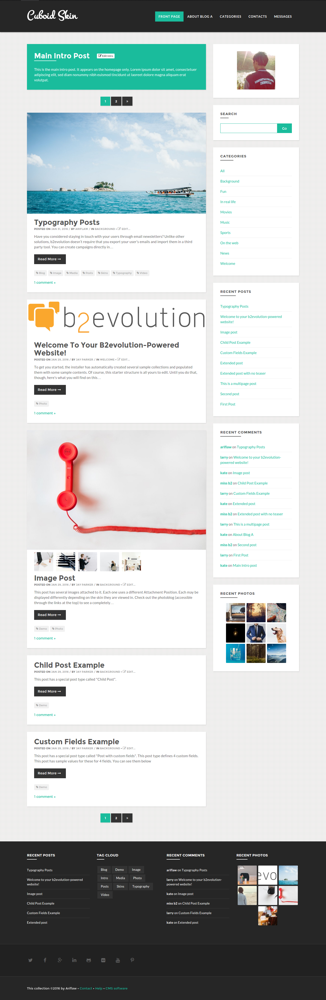
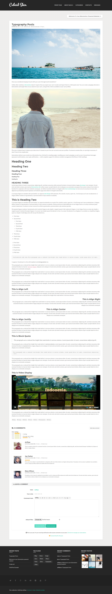

# Cuboid Skin b2evolution CMS Blog v6

**Cuboid** is a clean, unique and minimal content focus Blogging Skin perfect for bloggers. It is responsive means it will fit in various device of different size. It packs in robust yet easy-to-use backend system all managed through skin options on b2evolution. Perfect choice for your personal blog, niche blog, corporate blog, marketing blog, authority blog or any type of creative blog or simple magazine.

*Get Cuboid today and impress your readers!*

====
### Posts Page



### Single Post Page



====

### Some of the Features:

- 100% Responsive Design
- Unlimited Color Schemes
- Unlimited Background Color
- 5 Background Pattern
- Styling All Disp Skin
- Responsive Mobile Menu
- Full Width Elements
- Unlimited Sidebars Layout
- Full Post, Sidebar, and Grid
- One Column
- Right Sidebar
- Left Sidebar
- Photo Index Style Grid
- Masonry gallery with fullscreen popup
- Use Animation CSS
- Footer Widget
- Social Icon
- Back to top button
- Crossbrowser Compatible
- Free Updates and new features.
- Long-term Support
- And many more!

====

### Need Assistance? Get In Touch!

If you ever get stuck with setting up Cuboid with your B2evolution installation, you can get in touch with our friendly and dedicated support via our [Support Forum](http://forums.b2evolution.net/).

===

### Changes & Updates

```
Version 0.1
– Initial Version – Mei, 2016
```
