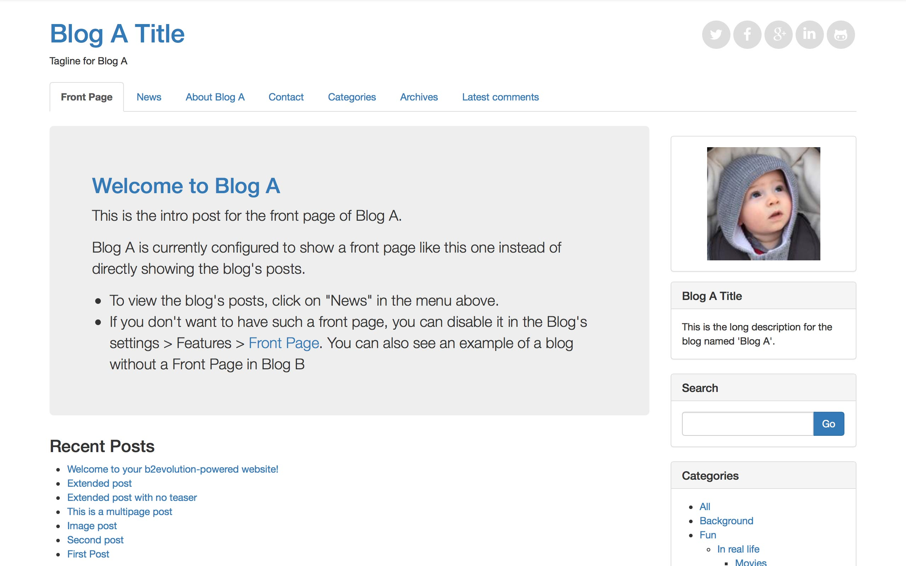

# Cuboid Skin b2evolution CMS Blog v6

**Cuboid** is a personal blogging skin tailored to be exceptional on B2evolution CMS. Not only its modern design is pleasing to the eyes, it packs in robust yet easy-to-use backend system all managed through skin options on b2evolution. Perfect choice for your personal blog, niche blog, corporate blog, marketing blog, authority blog or any type of creative blog or simple magazine.

*Get Cuboid today and impress your readers!*

====

### Front Page



### Posts Page


### Single Post Page


====

### Some of the Features:

- Fully Responsive Design
- Unlimited Color Schemes
- Unlimited Background Color
- 5 Background Pattern
- Styling All Disp Skin
- Use Animation CSS
- Responsive Mobile Menu
- Full Width Elements
- Unlimited Sidebars Layout
- Full Post, Sidebar, and Grid
- Photo Index Style Grid
- One Column
- Right Sidebar
- Left Sidebar
- Footer Widget
- Social Icon
- Back to top button
- Crossbrowser Compatible
- Free Updates and new features.
- Long-term Support

====

### Need Assistance? Get In Touch!

If you ever get stuck with setting up Cuboid with your B2evolution installation, you can get in touch with our friendly and dedicated support via our [Support Forum](http://forums.b2evolution.net/).

===

### Changes & Updates

```
Version 0.1
– Initial Version – February, 2016
```
